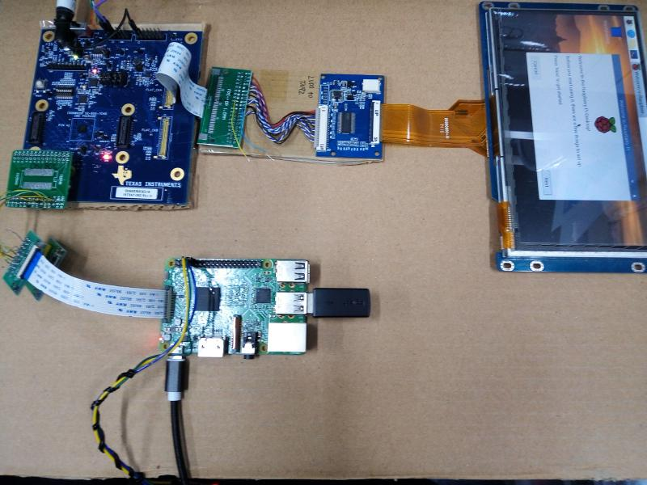
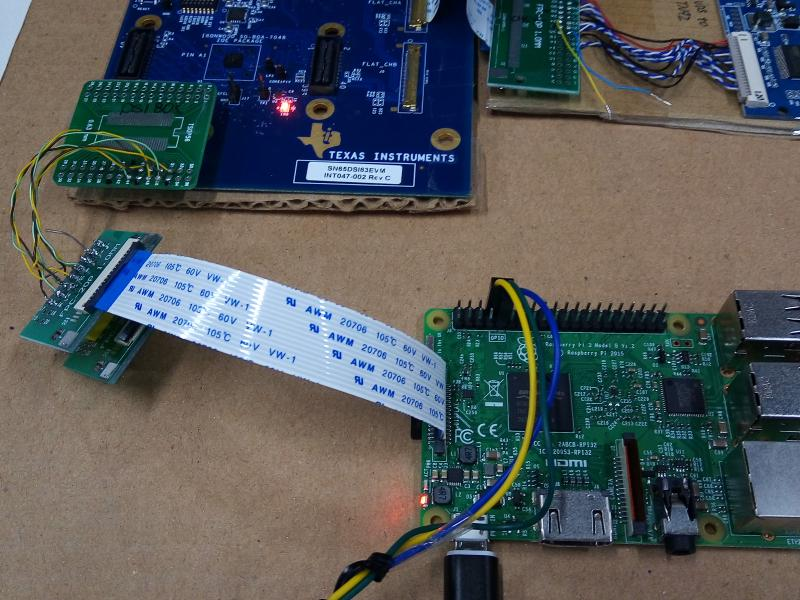
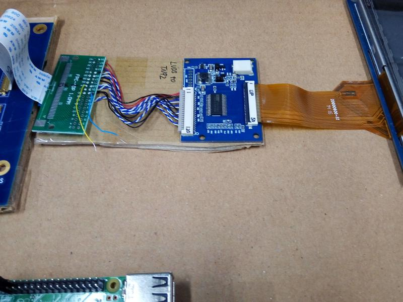

# rpi_dsi_driver_sn65_tn92
Test ok with rasp pi 3B, linux 5.10.103-v7+  
More operation , refer CNflysky/RPI_DSI_Drivers  
  
      
  
     
  
     

If the document help you, how about buy street cats a fish can ?
